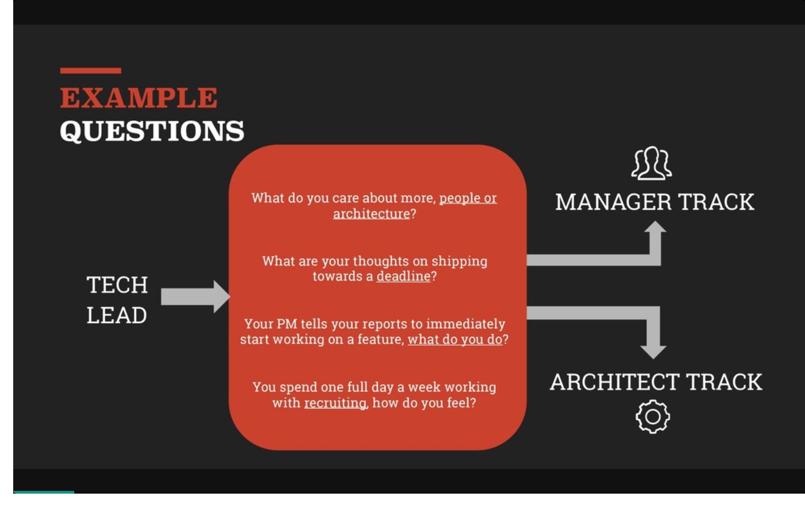

I recently [tweeted](https://twitter.com/sugarpirate_/status/1101943502592602113) that I was starting an experiment. 26 people applied to try this out! Over the next couple of weeks, I'll be speaking to as many of them as I can in one-on-one (1:1) meetings over Google Hangouts. With their permission, I hope to be able to share some of the advice I've given them with you.

https://twitter.com/sugarpirate_/status/1101943502592602113

Here is today's topic: growing as an engineer in the context of becoming a tech lead. The person I spoke to has been doing frontend development for most of their career, but was wondering if they needed to become fullstack in order to do a good job as a lead.

When we spoke, they told me that they didn't feel like they were ready because they didn't feel good enough yet on a technical level. That reminded me of myself when I first took on the role of a tech lead a few years ago. At the time, I didn't understand what being a tech lead really meant.

### What does a tech lead do anyway?

I used to think that the tech lead has to be the best programmer on the team. I was worried at the time because I felt like I had so much more to learn. If you stop and think about it from your manager's perspective though, moving your best programmer away from contributing code to helping out with managing the team isn't always a good decision. You're taking away some of the work this person is *really* good at, and you're moving them into a role where they need to do more of what they might not be great at -- managing people.

The tech lead is an interesting role. You're a hybrid engineer and leader who has to manage a small team, without much authority. The best tech leads are typically the engineers who've made a big impact in the way the team ships product. That could be engineering wise, for example in the form of tooling they've created to make other engineers on the team more productive. More commonly, it's because this engineer has strong organizational and leadership skills that makes everyone else on the team more effective. Have you heard of the "10x engineer"? That's what the best tech leads are, and not because they are 10x better.

https://twitter.com/heddle317/status/973203979889926145

### The Voight Kampff Test for Engineering Managers

I attended the [Calibrate](https://www.calibratesf.com/) conference last year, and I had the privilege of seeing [Nick Caldwell](https://twitter.com/nickcald) speak about ["Igniting the fire"](https://www.youtube.com/watch?v=URynuPW8fPg&list=PL8iMj9kx_ykSqcV7ro9VJDvE6FsQSMg2N). One of his slides spoke about the ["Voight Kampff test" for engineering managers](https://speakerdeck.com/calibrate/ignite-the-fire-management-that-sparks-new-leaders?slide=5). The Voight Kampff test is a reference from Blade Runner, and it's essentially a polygraph-like machine used by the LAPD's Blade Runners to assist in the testing of an individual to see whether they are a replicant (robot) or not.

<small>by Nick Caldwell</small>

I ran through these questions with them in our 1:1 and I found their answers to be somewhere in the middle. They acknowledged that they think architecture is important, but so are the people on the team. They didn't want to spend time on recruiting/hiring though, which sounds to me like this person wouldn't want to be an engineering manager at this point. Without knowing too much more about what they valued and how they worked, I suggested that moving into a tech lead role could be something worth trying out. Knowing what it is about their job that brought joy to them was key though, so I advised them to wait and see. In the meantime, figure out what it is that brings them satisfaction at work.

At worst, they'd figure out in a couple of months/years that being a tech lead isn't for them. There's a risk they might do poorly in this new role, so leaning into this takes a lot of self-awareness. They could lose their job if they completely mess it up! At best, you might learn that you really enjoy making your team more effective/productive, and consider a future role in engineering management. Either way, unless you truly make a big mess, you'll come out of it having learnt some valuable lessons.

### There are only 2 types of decisions

There are really only 2 types of decisions you'll face in your career: Type 1 and Type 2. Type 1 decisions are usually irreversible (or at least extremely difficult to reverse). Think quitting your job, or selling your company. Once you make a Type 1 decision, there's often no going back.

Type 2 decisions are easy to reverse. For example, taking on work in a new programming language, agreeing to do a talk, or accepting a promotion. While you might still consider Type 2 decisions important to deliberate about, they can be reversed with enough time and effort. In this case, I advised them that moving to a tech lead role is probably a Type 2 decision.

If you're considering taking on a new role as a tech lead or engineering manager, ask your manager what type of decision this is you're making. If it's Type 2, don't agonize over the decision too much. Speak to as many people as you can and get their advice, but don't lose too much sleep over it! If you have a strong support network at work, including your manager, it could be a potentially rewarding change.

### Growing as an engineer

Becoming a tech lead can be rewarding if you know what the role involves, and you think you might enjoy being a "force multiplier". If you're interested in learning more about engineering management, I highly recommend ["The Manager's Path"](https://smile.amazon.com/Managers-Path-Leaders-Navigating-Growth-ebook/dp/B06XP3GJ7F) by [Camille Fournier](https://twitter.com/skamille). It goes into greater detail about the path to engineering management.

That said, engineering management isn't the only career path for growth. Depending on where you work, your company may have a technical track that lets you go deeper into developing your technical skills. Keep in mind though, that even if you're a principle architect, your work will shift more and more towards understanding people & people skills, and less about raw programming ability.

I'll cover more on this topic in a later post.

Good luck!
