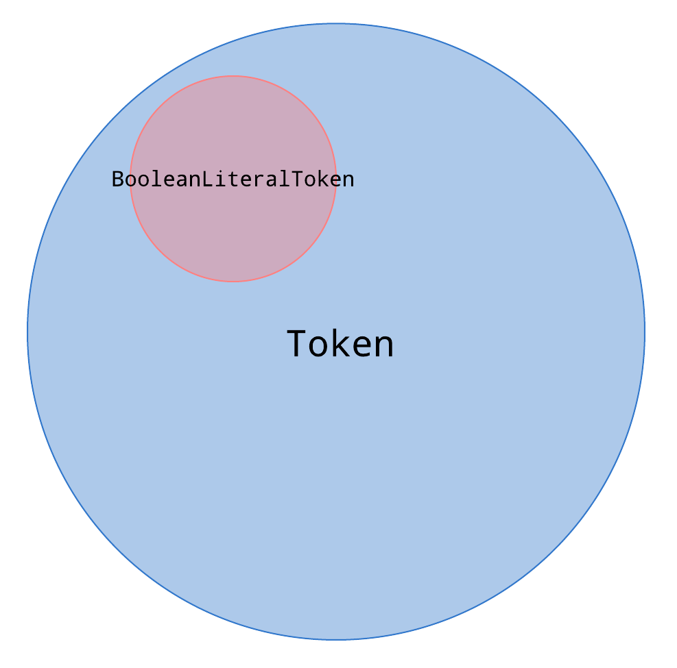

One of my 2020 resolutions is to learn how to create my [own programming language](https://github.com/poteto/boba-js), along with an interpreter and compiler for it. I'm writing the interpreter and compiler in TypeScript. My eventual goal is to compile it into `wasm`, and introduce some fun language features like pattern matching, the pipe `|>` operator from F#/Elixir, and other fun stuff I haven't yet thought about.

As of time of writing, I have mostly completed the lexer and parser for my interpreter and am about to jump into evaluation. I stream on [Twitch](https://www.twitch.tv/sugarpirate_) when I work on it (usually weekends PST), so check in if you're interested in watching!

This blog post is to share a TypeScript tip I've picked up while creating this language: type narrowing.

### Being precise helps TypeScript help you

When [lexing](https://en.wikipedia.org/wiki/Lexical_analysis) my language, I create tokens that represent the various language features you might use in your program: defining functions and variables, using infix operators like `+` in `x + y`, conditional logic, and so on. I created a `Token` type that represents a simple data structure representing my tokens. Each token has a `type` property that comes from an enum that represents the various syntax of my language:

```ts:title=token.ts
export type LiteralType = string;
export type Token = {
  type: TokenType;
  literal: LiteralType;
};
export const enum TokenType {
  ILLEGAL = 'ILLEGAL',
  EOF = 'EOF',

  // Identifiers + Literals
  IDENT = 'IDENT',
  INT = 'INT',

  // Operators
  ASSIGN = '=',
  PLUS = '+',
  MINUS = '-',
  BANG = '!',
  ASTERISK = '*',
  SLASH = '/',

  LT = '<',
  GT = '>',

  EQ = '==',
  NOT_EQ = '!=',

  // Delimiters
  COMMA = ',',
  SEMICOLON = ';',

  LPAREN = '(',
  RPAREN = ')',
  LBRACE = '{',
  RBRACE = '}',

  // Keywords
  FUNCTION = 'FUNCTION',
  LET = 'LET',
  TRUE = 'TRUE',
  FALSE = 'FALSE',
  IF = 'IF',
  ELSE = 'ELSE',
  RETURN = 'RETURN',
}
```

As an example, here's what my lexer tokenizes when it encounters this input:

```md
let add = fn(x, y) {
  x + y;
};
```

```ts
[
  { type: TokenType.LET, literal: 'let' },
  { type: TokenType.IDENT, literal: 'add' },
  { type: TokenType.ASSIGN, literal: '=' },
  { type: TokenType.FUNCTION, literal: 'fn' },
  { type: TokenType.LPAREN, literal: '(' },
  { type: TokenType.IDENT, literal: 'x' },
  { type: TokenType.COMMA, literal: ',' },
  { type: TokenType.IDENT, literal: 'y' },
  { type: TokenType.RPAREN, literal: ')' },
  { type: TokenType.LBRACE, literal: '{' },
  { type: TokenType.IDENT, literal: 'x' },
  { type: TokenType.PLUS, literal: '+' },
  { type: TokenType.IDENT, literal: 'y' },
  { type: TokenType.SEMICOLON, literal: ';' },
  { type: TokenType.RBRACE, literal: '}' },
  { type: TokenType.SEMICOLON, literal: ';' },
  { type: TokenType.EOF, literal: '' },
];
```

These tokens are iterated on by my parser, which parses the tokens and creates an Abstract Syntax Tree (AST). As it encounters tokens of different types (used in different contexts), it recursively creates AST nodes that take into account [operator precedence](https://en.wikipedia.org/wiki/Pratt_parser). Here's an example of an AST node that represents a boolean literal:

```ts:title=ast/nodes/boolean-literal.ts
export type BooleanLiteralToken = {
  type: TokenType.TRUE | TokenType.FALSE;
  literal: LiteralType;
};

export default class BooleanLiteral implements Expression {
  constructor(public token: BooleanLiteralToken, public value: boolean) {}

  expressionNode() { /** snip **/ }
  tokenLiteral() {  /** snip **/ }
  toString() { /** snip **/ }
}
```

The nice thing about this code is that the TypeScript compiler prevents me from creating an instance of the `BooleanLiteral` AST node if the current token is not of type `TRUE` or `FALSE`. This makes intuitive sense as I'd never want to have a `BooleanLiteral` AST node created for the token type of `SEMICOLON`. You could say that the `BooleanLiteral` constructor accepts a _narrower_ version of the type `Token`.



The problem now is that as I iterate through all the tokens from our input, TypeScript has no way to tell what kind of `Token` we're currently examining. In fact, it throws a compiler error. How can we tell TypeScript what kind of token we've encountered?

```ts:title=parser/prefix/parse-boolean-literal.ts
export default function parseBoolean(this: Parser): Expression {
  return new BooleanLiteral(this.currToken, /* ... */);
  //                        ^^^^^^^^^^^^^^
  // Argument of type 'Token' is not assignable to parameter of type
  // 'BooleanLiteralToken'.
  //   Types of property 'type' are incompatible.
  //     Type 'TokenType' is not assignable to type
  //     'TokenType.TRUE | TokenType.FALSE'.ts(2345)
}
```

#### Type narrowing with assertion functions

TypeScript 3.7 introduces a new feature: [assertion functions](https://www.typescriptlang.org/docs/handbook/release-notes/typescript-3-7.html#assertion-functions). Like type guards, using an assertion function lets you reassure the compiler that you have a more precise type. It also captures a common pattern in JavaScript, where we assert on [invariants](https://www.npmjs.com/package/invariant) that must hold true at runtime.

To assert that the current token that's being examined when the `parseBoolean` function is called is either `{ type: TokenType.TRUE }` or `{ type: TokenType.FALSE }`, we can use an assertion function that both narrows the type as well as throws a helpful runtime error if it does encounter something it's not expecting:

```ts:title=utils/assert-token-type.ts
export default function assertTokenType<T extends TokenType>(
  token: Token,
  ...assertedTokenTypes: T[]
): asserts token is { type: T; literal: LiteralType } {
  const satisfiesAssertion = assertedTokenTypes.some(
    type => type === token.type
  );
  if (!satisfiesAssertion) {
    throw new AssertionError({
      message: `Token type is not: ${assertedTokenTypes.join(' OR ')}`,
    });
  }
}
```

After using the above assertion, TypeScript now knows that `this.currToken` must be either a token of type `TRUE` or `FALSE`:

```ts:title=parser/prefix/parse-boolean-literal.ts
export default function parseBoolean(this: Parser): Expression {
  assertTokenType(this.currToken, TokenType.TRUE, TokenType.FALSE)
  return new BooleanLiteral(this.currToken, /* ... */);
  //                        ^^^^^^^^^^^^^^
  // (property) Parser.currToken: {
  //   type: TokenType.TRUE | TokenType.FALSE;
  //   literal: string;
  // }
}
```

And in the event that something goes awry at runtime, I can at least throw an assertion error to help me debug the issue.

#### Type narrowing with type guards

Another handy way to narrow a type is to use [type guards](https://www.typescriptlang.org/docs/handbook/advanced-types.html#type-guards-and-differentiating-types).

Here's a common util that I use to check if an object has a property defined:

```ts:title=utils/has-own-property.ts
export default function hasOwnProperty<T>(
  obj: T,
  key: PropertyKey
): key is keyof T {
  return Object.prototype.hasOwnProperty.call(obj, key);
}
```

For example, this allows me to narrow the broad `ident` type in the `lookupIdentifier` function from `string` ([cardinality](https://en.wikipedia.org/wiki/Cardinality): ∞) to the union type of string literals (cardinality: 7) that encompass the keys in my `KEYWORDS` map:

```ts:title=token.ts
const KEYWORDS = {
  fn: TokenType.FUNCTION,
  let: TokenType.LET,
  true: TokenType.TRUE,
  false: TokenType.FALSE,
  if: TokenType.IF,
  else: TokenType.ELSE,
  return: TokenType.RETURN,
} as const;

export function lookupIdentifier(ident: string) {
  if (hasOwnProperty(KEYWORDS, ident)) {
    return KEYWORDS[ident];
    //              ^^^^^
    // (parameter) ident:
    //   | "fn"
    //   | "let"
    //   | "true"
    //   | "false"
    //   | "if"
    //   | "else"
    //   | "return"
  }
  return TokenType.IDENT;
}
```

TypeScript can even infer the return type from my function signature without the need for me to be explicit:

```ts
// inferred by TypeScript
function lookupIdentifier(
  ident: string
):
  | TokenType.IDENT
  | TokenType.FUNCTION
  | TokenType.LET
  | TokenType.TRUE
  | TokenType.FALSE
  | TokenType.IF
  | TokenType.ELSE
  | TokenType.RETURN;
```

Neat!

### Conclusion

In addition to assertion functions and type guards, you can also narrow types using the `in` operator, `typeof` type guards, `instanceof` type guards, and `if` statements.

Type narrowing gives TypeScript more information about the type being narrowed, and allows the TypeScript compiler to be more helpful to you. When used responsibly, narrowing types can make your code easier to understand. However, it can also be easy to get carried away with making your types extremely precise. I speak about this in my talk at TSConf ([recording](https://www.youtube.com/watch?v=p5Hwb1YbNMY&feature=youtu.be&list=PL2z7rCjEG2kumYQw0tl-afLYWUk-kKREB&t=1117), [slides](https://speakerdeck.com/poteto/tsconf-2019-just-use-any-how-to-win-colleagues-and-influence-your-boss?slide=69)).

Knowing when this tool is valuable, and when its not is part of the fun, pragmatism, and challenge of programming. I leave you with this quote from a [talk by Runar Bjarnason](https://www.youtube.com/watch?v=GqmsQeSzMdw&feature=youtu.be) about constraints:

> When we restrict what we can do, it's easier to understand what we can do.