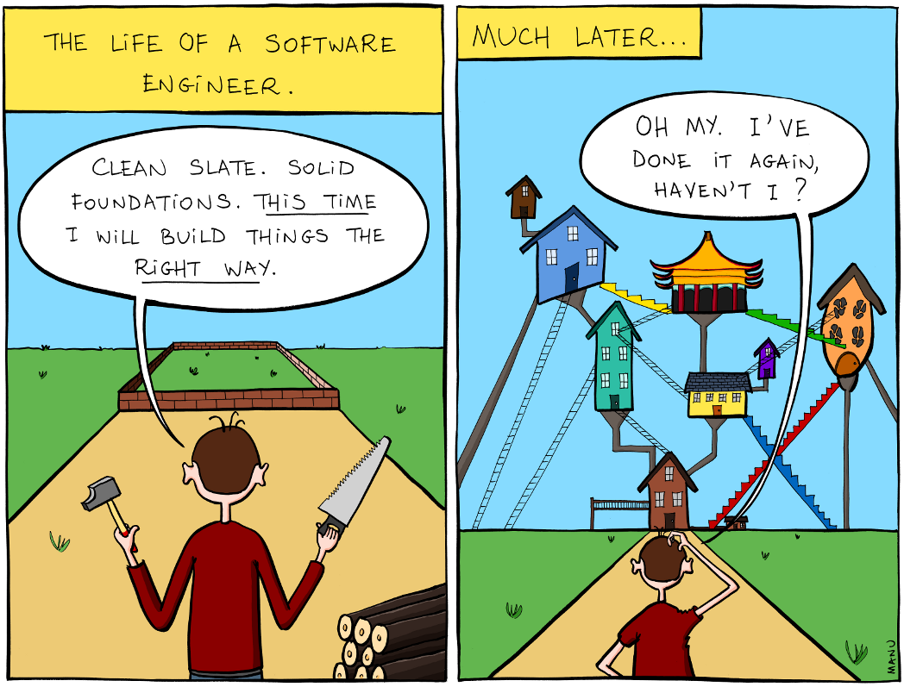

This time is different. "Clean slate. Solid foundations. This time I will build things the right way."

Early on in my career, I used to be obsessed with "best practices". I wanted to write code that would stand the test of time. Code that was objectively ideal. After all, my programming idols on Twitter said it was good. This is clearly the best way of building software. Who am I to question them?

This is the same mindset that leads to pursuit of the shiniest of tech stacks. If it works for BigCorp, surely it works for us. How can I convince my boss to let me use Rectangle, Crust, and GiraffeQL™ to build our new serverless CRUD app orchestrated by AWS step functions? We need to use microservices, the best state management patterns, and only the purest of functional programming paradigms, so we are future proof. We will never need to rewrite our app because of our perfect foundation.

### Best practice today, anti-pattern tomorrow

As I worked on more projects, I started to question the dogma I believed so strongly in. If I had to identify the turning point, it was when I first started learning a new programming language, Elixir. Up to that point, Ruby and JavaScript were the tools I knew best. It turns out that there's truth behind Maslow's Hammer--"I suppose it is tempting, if the only tool you have is a hammer, to treat everything as if it were a nail."

Learning a new language that was unlike anything I had used before was humbling. I struggled for hours trying to understand pattern matching. Variable declarations are one of the first things you learn as a total beginner in any programming language. Yet here I was struggling to understand it, despite having done this for a few years.

https://twitter.com/sugarpirate_/status/1256254398121955328

I've picked up more languages and tools since then, but the humbling lessons don't stop. Paradoxically, the more I know, the less I understand.

Not too long ago, I would sometimes do this annoying manager thing in 1:1s. Someone would come to me with a question. I learned not to immediately reply with the answer. Instead, I'd ask what they thought it should be. I didn't do this to actually be annoying, but to help the engineers on my team understand that dealing with ambiguity and making tradeoffs is part of the job. That they knew better than I did, and that there rarely was a clear answer.

We often look to heuristics like Twitter follower count, stars on GitHub, and other proxies to tell us what we should do next. That's fair--sometimes, you just want to get your job done. Software is still a relatively young industry, and it seems to change rapidly. That often is overwhelming. But don't start from the default of thinking that this must be good because someone else said so. Consider the problem you're trying to solve, the opportunity costs going with this solution instead of another, and the tradeoffs your team is comfortable making.

### This time is no different

I learn from many random sources on the internet. One source I find myself going back to often are videos about cooking. There's something magical about watching people make things. And I like to eat.

When I first watched [Jiro Dreams of Sushi](https://www.netflix.com/title/70181716) almost 10 years ago, I didn't understand what drove Ono. His obsession with perfection seemed pointless. Surely at some point, after decades of making sushi, there would be nothing left to perfect.

I've come to realize that perfection is not a destination. It's an incremental journey, process, or whatever you want to call it. Whether it's today's project, or a project I'll work on next year, every piece of software is the same, only different.

Instead of seeing code as a rigid structure, like a building, think of your software as a living thing. Every project changes and grows over time, and they are rarely the same. And like things that constantly change, software is never finished. It just gets released.

> "We are simply never going to realize a state of software nirvana where everything is supremely satisfying. That’s an important emotional realization. The fundamental reward of an improvement process is the experience of betterment, not some mythical destination." - [Mark Slee](http://mcslee.com/)

---

This blog post was inspired by this [writing](https://engineering.fb.com/uncategorized/thoughts-on-software-quality/) from Mark Slee. It was written 10 years ago, but it's still excellent. Highly recommended.
